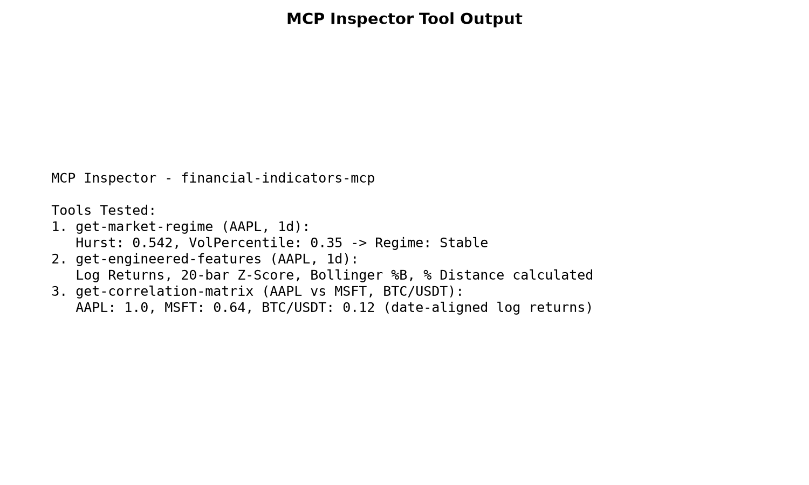

# financial-indicators-mcp

Market data, technical analysis, statistical regime detection, and risk metrics exposed as Model Context Protocol (MCP) tools for LLM agents.



## Why

LLMs analyzing market movements require structured, verifiable financial metrics rather than unstructured web search results. `financial-indicators-mcp` connects LLM agents directly to date-aligned returns, volatility-calibrated regime detection, and statistical risk estimators via the standard Model Context Protocol.

## How it works

The server exposes 11 tools communicating over standard input/output (stdio):

| Tool | Description |
|---|---|
| `get-price` | Get current price for a stock or crypto symbol |
| `get-indicators` | Calculate technical indicators (RSI, MACD, Bollinger Bands) and market regime |
| `plot-indicators` | Generate a PNG plot of price action and technical indicators |
| `get-market-news` | Fetch latest market news, optionally filtered by symbol |
| `get-market-regime` | Classify the regime as Trending, Mean-Reverting, High-Volatility or Stable from a multi-window Hurst estimate (compared with simulated random walks) and the current volatility percentile. |
| `get-engineered-features` | Return log returns, the 20-bar z-score, Bollinger %B and the % distance from the 20-bar mean. |
| `get-headline-keyword-score` | Score recent Yahoo Finance headlines with a small keyword list from −1 (bearish) to 1 (bullish). A rough heuristic, not a language model. The raw headlines are returned too. |
| `simulate-trade` | Net P&L of one long trade after a 0.2% taker fee per side and slippage of 10% of the 14-day ATR. |
| `get-correlation-matrix` | Pearson correlation of log returns between a base symbol and each benchmark, aligned by date. null = not enough overlapping data. |
| `get-portfolio-risk-metrics` | Historical VaR at 95% and 99% (the 5th and 1st percentile of the returns you pass; negative = loss) and the Kelly fraction for your win rate and win/loss ratio. |
| `get-momentum-score` | Momentum score from −1 to 1: the % change over the window × 10, capped. A 10% move gives ±1. |

## Results

Command: `npm run build && node dist/scripts/eval-keywords.js Sentences_AllAgree.txt`

Evaluated on the Financial PhraseBank dataset (Malo et al., 2014):

| Metric | Measured Value |
|---|---|
| Sample size (sentences) | 2,264 |
| Keyword heuristic accuracy | 0.621 |
| Always-neutral baseline | 0.614 |

The simple keyword dictionary marginally exceeds the always-neutral baseline by 0.7 percentage points, demonstrating that word matching functions only as a rough baseline rather than a true sentiment model.

## Quickstart

```bash
git clone https://github.com/thekogit/financial-indicators-mcp.git
cd financial-indicators-mcp
npm ci
npm run build
npx @modelcontextprotocol/inspector node dist/index.js
```

Configure in Claude Desktop or an MCP client:

```json
{
  "mcpServers": {
    "financial-indicators": {
      "command": "node",
      "args": ["/absolute/path/to/financial-indicators-mcp/dist/index.js"]
    }
  }
}
```

## Tests

```bash
npm test
```

## Limitations

- Yahoo Finance is an unofficial API with delayed data
- No built-in authentication or rate-limit tokens on endpoints
- Hurst exponent estimation on 100 bars remains noisy
- The headline keyword scorer is a simple baseline heuristic
- Not financial or investment advice

## How I used AI

I used Antigravity to draft parts of the code. I chose the design, reviewed every change, rewrote the Hurst calibration and date-aligned return correlation, and wrote the tests in src/ to check it. Agent-made commits are visible in the history.

## License

MIT License. See [LICENSE](LICENSE) for details.
